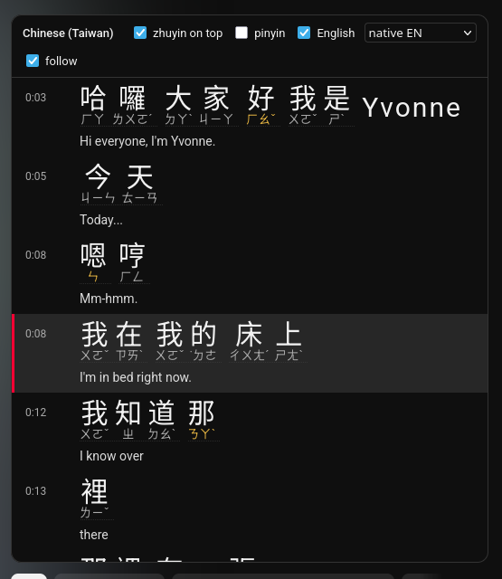

# yt-zhuyin

A Firefox userscript that adds a side panel to YouTube watch pages showing the video's traditional Chinese captions with 注音 (zhuyin / bopomofo) next to every character, plus an aligned English line. Built for learning Taiwanese Mandarin from real videos.



## What it does

- Reads the video's Chinese caption track (prefers `zh-TW`, then `zh-Hant`, `zh-HK`, `zh`) and shows it in a scrollable panel above the recommendations column.
- Splits each line into words using a Taiwan Mandarin dictionary and prints zhuyin for every character. Readings come from the dictionary, not from pinyin — 垃圾 is ㄌㄜˋ ㄙㄜˋ, 星期 is ㄒㄧㄥ ㄑㄧˊ, 會計 is ㄎㄨㄞˋ ㄐㄧˋ.
- Zhuyin sits in a vertical column to the right of each character, the way Taiwanese books set it. A toggle moves it above the characters if that's easier while you're learning the symbols.
- Optional pinyin line, derived from the zhuyin.
- English line under each segment: the channel's own English track if there is one, otherwise YouTube's auto-translation. A dropdown switches between the two.
- Click a line to seek. The current line is highlighted and the panel follows playback.
- No Chinese track, or a badly segmented auto one? Point the panel at a local Whisper server (`asr_server.py`) and it transcribes the audio on your own CPU, re-chunks it into readable lines, and can translate them too.
- Characters shown in amber are polyphonic and were read on their own, without a dictionary word to settle the reading. Hover to see the alternatives.

Everything runs in the browser. No accounts, no external services; the only network requests are to YouTube's own caption endpoint and to the CDN that serves the dictionary file. Videos without usable Chinese captions can fall back to a local Whisper server you run yourself — see [Running the local Whisper server](#running-the-local-whisper-server-optional).

## Install

1. Install a userscript manager. [Violentmonkey](https://violentmonkey.github.io/) is open source (MIT) and the one this was tested with. [Tampermonkey](https://www.tampermonkey.net/) works too but is closed source. Greasemonkey 4 is not recommended — its `@require` handling is unreliable.
2. Open the raw script URL and the manager will offer to install it:

   https://raw.githubusercontent.com/ashirviskas/yt-zhuyin/main/yt-zhuyin-transcript.user.js

   Install from that URL rather than pasting the source, so the manager can pick up updates.
3. Open any YouTube video with Chinese captions. The panel appears within a few seconds. Captions may flash on briefly while the script sets things up; that's expected.

The dictionary (`zhuyin-dict.js`, about 6 MB) is pulled once by the userscript manager through jsDelivr and cached.

### Fonts

Zhuyin glyphs and tone marks look best with a CJK font that includes bopomofo. On Arch: `sudo pacman -S noto-fonts-cjk`. On Fedora: `sudo dnf install google-noto-sans-cjk-fonts`. Without one, Firefox falls back to whatever font has the code points and the tone marks come out uneven.

## Running the local Whisper server (optional)

Videos with no Chinese caption track — and auto-generated tracks that segment badly — can be transcribed
locally instead. `asr_server.py` downloads the audio with yt-dlp, runs faster-whisper on the CPU, converts
the result to Taiwan traditional characters, and serves it to the panel over `127.0.0.1`. Nothing leaves your
machine except the YouTube download itself.

The script carries PEP 723 inline metadata, so [uv](https://docs.astral.sh/uv/) builds and caches the
environment itself. There is nothing to install by hand and no virtualenv to activate:

```sh
sudo dnf install uv                  # or: curl -LsSf https://astral.sh/uv/install.sh | sh
uv run asr_server.py                 # small model; first run resolves deps into ~/.cache/uv
uv run asr_server.py --model medium  # better Mandarin, ~1.5 GB RAM, 2-3x slower
```

The shebang is `uv run --script`, so `chmod +x asr_server.py && ./asr_server.py` works too. yt-dlp is invoked
as `python -m yt_dlp` inside that environment, so no binary needs to be on your `PATH`.

To pin the resolved versions instead of re-checking them on every start:

```sh
uv lock --script asr_server.py       # writes asr_server.py.lock next to the script
```

Leave it running in a terminal. The userscript talks to it at `http://127.0.0.1:8765` (`CFG.asrServer`) and
falls back to it automatically when a video has no Chinese track; the source dropdown in the panel header has
a **whisper (local)** entry to force it on any video. Transcription streams in — lines appear as they are
decoded — and the panel polls while it works.

Useful flags:

| Flag | Default | Meaning |
|---|---|---|
| `--model` | `small` | `tiny`/`base`/`small`/`medium`/`large-v3`, or a Hugging Face repo id |
| `--port` | `8765` | must match `CFG.asrServer` in the userscript |
| `--mt` | `Helsinki-NLP/opus-mt-zh-en` | model behind `/translate`; `none` disables local English |
| `--audio-cache-gb` | `2.0` | keep downloaded audio up to this size (LRU); `0` discards it |
| `--lease-sec` | `60` | pause a job when no browser tab has polled it for this long |

### Checking on it

`GET /status` reports everything the server is doing — every job with its progress, throughput and ETA, plus
memory, queue, model state and cache sizes. Add `?pretty=1` to read it in a browser tab.

```sh
curl -s localhost:8765/status?pretty=1
```

```json
{
  "server": { "pid": 2388633, "uptime_sec": 27.0, "port": 8765, "lease_sec": 60 },
  "model":  { "name": "small", "loaded": true, "device": "cpu", "compute_type": "int8", "opencc": true },
  "mt":     { "name": "Helsinki-NLP/opus-mt-zh-en", "loaded": false, "cache_entries": 65, "unsaved": 0 },
  "memory": { "rss_mb": 229.7, "peak_rss_mb": 285.3, "system_total_mb": 7737.0, "system_available_mb": 2957.4 },
  "jobs": [
    { "vid": "dQw4w9WgXcQ", "status": "transcribing", "progress": 0.41,
      "segments": 128, "words": 1902, "audio_duration_sec": 412.0, "transcribed_sec": 168.9,
      "elapsed_sec": 73.4, "speed_x": 2.3, "eta_sec": 106,
      "age_sec": 80.1, "last_seen_sec_ago": 1.2, "lease_expires_in_sec": 58.8, "error": null }
  ],
  "queue": [],
  "totals": { "transcribing": 1 },
  "cache": { "audio_mb": 107.5, "audio_limit_mb": 2147, "audio_files": 5,
             "transcripts": 4, "partials": 0, "dir": "/home/you/.cache/yt-zhuyin" }
}
```

`speed_x` is audio seconds decoded per wall second, so `2.3` means a 10-minute video takes about 4½ minutes.
`lease_expires_in_sec` counts down to the pause described below.

Jobs are tied to a polling tab: close the tab and the current job pauses within a minute, keeping whatever it
had decoded; reopening resumes from there. Finished transcripts live in `~/.cache/yt-zhuyin/<videoId>.json`,
audio in `~/.cache/yt-zhuyin/audio/`, and translated lines in `~/.cache/yt-zhuyin/mt_cache.json`. Delete any of
them to start over.

The first run downloads the Whisper weights (~500 MB for `small`) and, on the first English line, the
translation model (~300 MB). Both are cached by Hugging Face under `~/.cache/huggingface/`.

### Running it as a service

To keep it up across reboots, drop this in `~/.config/systemd/user/yt-zhuyin-asr.service`. `PATH` is set
explicitly because user units do not inherit your shell's `~/.local/bin`:

```ini
[Unit]
Description=yt-zhuyin local ASR

[Service]
Environment=PATH=%h/.local/bin:/usr/local/bin:/usr/bin
WorkingDirectory=%h/projects/yt-zhuyin
ExecStart=uv run asr_server.py --model small
Restart=on-failure
RestartSec=5

[Install]
WantedBy=default.target
```

Point that first `PATH` entry at wherever uv actually landed (`command -v uv`), then:

```sh
systemctl --user daemon-reload
systemctl --user enable --now yt-zhuyin-asr
journalctl --user -u yt-zhuyin-asr -f
```

The first start sits in "loading" for a minute or two while the model downloads.

### Local English

When YouTube offers neither an English track nor an auto-translation, the panel asks the server to translate
the Chinese lines itself (`CFG.localTranslate`). Lines are grouped into sentences first, translated in
batches, and cached in IndexedDB in the browser as well as on the server, so a video you revisit is instant.
Set `CFG.localTranslate` to `false` to keep the panel Chinese-only.

## Settings

Open the script in your userscript manager and edit the `CFG` block at the top (in this repo that block is `src/00-config.js`). The ones you're most likely to touch:

| Key | Default | Meaning |
|---|---|---|
| `zhuyinLayout` | `'side'` | `'side'` for the vertical column, `'top'` for horizontal above the character |
| `hanFontSize` / `zhuyinFontSize` | `30px` / `14px` | sizes in the side layout |
| `showPinyin` | `false` | pinyin line on by default |
| `englishDefault` | `'native'` | `'native'` prefers the channel's English track, `'translate'` prefers auto-translation (which lines up 1:1 with the Chinese) |
| `restoreCaptions` | `true` | put player captions back to their previous state after setup; set `false` to leave zh-TW subtitles on and avoid the flash |
| `wordGap` | `true` | dotted underline and spacing between dictionary words |
| `asrServer` | `'http://127.0.0.1:8765'` | local Whisper server; `null` disables the fallback entirely |
| `localTranslate` | `true` | ask that server for English when YouTube has none |

The header toggles (pinyin, English, zhuyin on top, follow) change the current panel only; edit `CFG` to change defaults.

## How it works

YouTube's caption endpoint needs a per-session token that the player attaches to its own requests. The script asks the player to load a caption track, watches the Performance API for that request, and reuses the signed URL with different `lang`/`tlang` parameters. Nothing is patched or intercepted.

Each caption line is segmented with a unigram maximum-likelihood search over the dictionary (Viterbi over word frequencies), so longer known words win over character-by-character readings. Pinyin is generated from the zhuyin through a fixed table, so the two can never disagree.

## Building the userscript

`yt-zhuyin-transcript.user.js` is generated — **edit `src/`, not that file.** The whole script is one IIFE
sharing a single closure, so the build is ordered concatenation and nothing more: no bundler, no npm, no
module system. `build.py` is stdlib-only.

```sh
python3 build.py          # or: uv run build.py
python3 build.py --check  # exits 1 if the committed userscript is stale
```

Sources are concatenated in filename order, which is what the numeric prefixes are for — adding a file never
means editing `build.py`:

| File | Contents |
|---|---|
| `src/header.txt` | the `==UserScript==` block (`@version` lives here — the only copy) and the pipeline comment |
| `src/00-config.js` | `CFG` |
| `src/10-segment.js` | unigram max-likelihood segmentation |
| `src/20-pinyin.js` | zhuyin normalisation and the zhuyin → pinyin tables |
| `src/30-helpers.js` | `log`, `sleep`, `waitFor`, `fmtTime`, `trackName` |
| `src/40-captions.js` | track selection, timedtext URL harvesting, fetching, overlap alignment |
| `src/50-cache.js` | IndexedDB: transcript cache and translation memory |
| `src/60-render.js` | CSS, `renderZh`, `buildPanel`, `showStatus` |
| `src/70-chunk.js` | re-chunking whisper word timestamps into readable lines |
| `src/80-translate.js` | sentence grouping and the local-translation driver |
| `src/85-asr.js` | the local Whisper path |
| `src/90-main.js` | `init()` and the navigation hook |

The generated file stays committed at the repo root, along with `zhuyin-dict.js` — both are public URLs that
installed copies fetch (`@require`, `@downloadURL`), so neither can move into a `dist/` directory without
breaking every existing install.

If you want the staleness check enforced, `.git/hooks/pre-commit`:

```sh
#!/bin/sh
exec python3 build.py --check
```

## Working on the Python service

`asr_server.py` is the entry point — argparse, the PEP 723 dependency block, and wiring. The rest is a small
package next to it:

| File | Contents |
|---|---|
| `ytz_asr/__init__.py` | `Config`, shared types, `log()` |
| `ytz_asr/jobs.py` | `Job` and `JobStore` — every piece of mutable state, behind one lock |
| `ytz_asr/asr.py` | yt-dlp download, the audio LRU cache, Whisper transcription, the worker loop |
| `ytz_asr/translate.py` | the Marian zh→en model and its translation memory |
| `ytz_asr/server.py` | the HTTP handler, routes, and the `/status` payload |

Needs Python 3.13+. It stays on `http.server` rather than a web framework: three endpoints on loopback don't
justify the dependency.

Type checking is basedpyright in standard mode, run against the environment uv builds for the script:

```sh
uv sync --script asr_server.py
uvx basedpyright --pythonpath "$(uv python find --script asr_server.py)"
```

That should report zero errors. There is one `# pyright: ignore` in `translate.py`, for an upstream bug where
transformers' own stubs won't admit `MarianMTModel` to their generation protocol.

## Rebuilding the dictionary

`build_zhuyin_dict.py` reads McBopomofo's data files and writes `zhuyin-dict.js`. To rebuild:

```sh
for f in BPMFMappings.txt BPMFBase.txt phrase.occ heterophony1.list heterophony2.list heterophony3.list; do
  curl -sLO https://raw.githubusercontent.com/openvanilla/McBopomofo/master/Source/Data/$f
done
mv BPMFMappings.txt mc.txt
python3 build_zhuyin_dict.py
```

There's a small `OVERRIDE` table near the top of the script for characters whose IME-preferred reading isn't the textbook one (particles like 嗎, 呢, 吧 read with a neutral tone). Add to it in zhuyin.

After pushing a new `zhuyin-dict.js`, bump `@version` in `src/header.txt`, rebuild, and push the regenerated userscript so managers refetch the `@require`, and purge the jsDelivr cache or wait up to 12 hours:

    https://purge.jsdelivr.net/gh/ashirviskas/yt-zhuyin@main/zhuyin-dict.js

## Known limitations

- Segment boundaries are the caption author's. A word split across two caption lines is read as two separate characters.
- Auto-generated (ASR) Chinese tracks arrive as short fragments and segment poorly.
- Citation tones only; tone sandhi (一, 不, third-tone pairs) is not shown.
- Panel placement depends on YouTube's `#secondary` layout. When YouTube changes its markup the panel may end up in the wrong place or not appear.

## License

MIT. See `LICENSE`.

`zhuyin-dict.js` is derived from [McBopomofo](https://github.com/openvanilla/McBopomofo)'s dictionary data (MIT, © Mengjuei Hsieh et al.), which in turn descends from libtabe's `tsi.src` (BSD).
